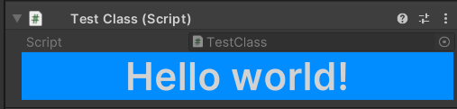
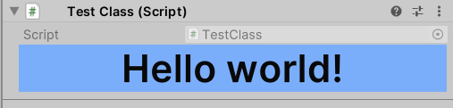
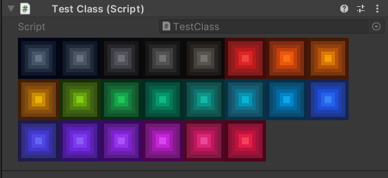
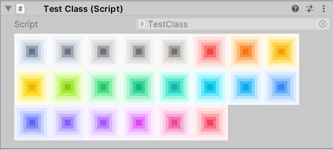

# UIToolkit Codex

Code extensions for UI Toolkit for UIElements editors without uxml's or for cleaner UIE coding

# Installation
From openupm: https://openupm.com/packages/com.novareactor.uitoolkitcodex/

Or using git in url package manager `git@github.com:FColor04/UIToolkitCodex.git`

[](https://openupm.com/packages/com.novareactor.uitoolkitcodex/)

<!-- TOC -->
* [UIToolkit Codex](#uitoolkit-codex)
* [Installation](#installation)
* [Why?](#why)
  * [Turn this:](#turn-this)
  * [Into that:](#into-that)
    * [Makes inline style actually readable](#makes-inline-style-actually-readable)
        * [And has adaptive color palettes for light & dark editor themes & Tailwind colors](#and-has-adaptive-color-palettes-for-light--dark-editor-themes--tailwind-colors)
  * [Tailwind adaptive colors!](#tailwind-adaptive-colors)
* [All features:](#all-features)
* [UI Elements](#ui-elements)
  * [Alert element](#alert-element)
* [Plugin is still in development](#plugin-is-still-in-development)
<!-- TOC -->

---
# Why?

To write styled editors within code without uxml's

## Turn this:
```csharp
[CustomPropertyDrawer(typeof(bool))]
public class ExampleEditor : PropertyDrawer
{
    public override VisualElement CreatePropertyGUI(SerializedProperty property)
    {
        var root = new VisualElement();
        var toggleField = new PropertyField(property);
        root.schedule.Execute(() =>
        {
            var toggleElement = toggleField.Q("unity-checkmark");
            toggleElement.style.width = 48;
            toggleElement.style.height = 48;
            toggleElement.style.backgroundColor = new StyleColor(Color.red);
            toggleElement.style.alignItems = new StyleEnum<Align>(Align.Center);
            toggleElement.style.justifyContent = new StyleEnum<Justify>(Justify.Center);
        });
        root.Add(toggleField);
        return root;
    }
}
```
## Into that:
```csharp
[CustomPropertyDrawer(typeof(bool))]
public class ExampleEditor : PropertyDrawer
{
    public override VisualElement CreatePropertyGUI(SerializedProperty property)
    {
        var root = new VisualElement();
        var toggleField = new PropertyField(property)
            .DeferredStylize(s => s.W(48).H(48).Bg(Color.red).FlexCenter(), 
                "unity-checkmark");
        root.Add(toggleField);
        return root;
    }
}

---

```
### Makes inline style actually readable
**And has adaptive color palettes for light & dark editor themes & Tailwind colors**
```csharp
new Label("Hello world!").Stylize(s => s.W(400).FlexCenter().TextCenter().Text4Xl().Bold().Bg(EditorPalette.AccentColor));
```




## Tailwind adaptive colors!

```csharp
public override VisualElement CreatePropertyGUI(SerializedProperty property)
    {
        var root = new VisualElement().Stylize(s => s.P(4).FlexWrap().FlexRow());
        foreach (var palette in TailwindPalette.Palettes)
        {
            root
                .Append(new VisualElement().Stylize(s => s.Bg(palette.S50S950.Pick()).P(4))
                    .Append(new VisualElement().Stylize(s => s.Bg(palette.S100S900.Pick()).P(4))
                        .Append(new VisualElement().Stylize(s => s.Bg(palette.S200S800.Pick()).P(4))
                            .Append(new VisualElement().Stylize(s => s.Bg(palette.S300S700.Pick()).P(4))
                                .Append(new VisualElement().Stylize(s => s.Bg(palette.S400S600.Pick()).P(4))
                                    .Append(new VisualElement().Stylize(s => s.Bg(palette.S500S500.Pick()).P(4))))))));
        }
        return root;
    }
```



---

# All features:
- Adaptive colors, 22 tailwind palettes, 1 unity palette
- Rem unit for text sizes
- Style extensions for visual elements & derivatives, including:
  - Background color (All colors soon)
  - Size
  - Padding
  - Margin
  - Border
  - Display
  - Position
  - Overflow
  - Text


# UI Elements

---

## Alert element
```csharp 
    new Alert("Info!", TailwindPalette.Blue)
    new Alert("Warning!", TailwindPalette.Yellow)
    new Alert("Error!", TailwindPalette.Red)
```


---

# Plugin is still in development
Made by FColor04